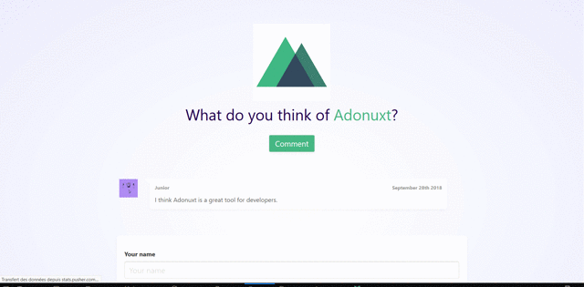

## Realtime search feature with Pusher.

A live commenting system with Adonis.js, Vue.js using Pusher for realtime stuff 

## Getting Started
Make sure you have `npm` and `yarn` on your local machine

1.  Clone this repository and cd into it
2.  Run `yarn` or `npm install` to download dependencies
3.  Set up your [pusher account](https://dashboard.pusher.com/accounts/sign_up)
4.  Set up your database in your `.env` file and run php `adonis migration:run`
5.  Execute `npm run asset-dev` to build project assets
6.  Execute `adonis serve --dev` to run the project in your browser
7.  See the [tutorial](https://pusher.com/tutorials/live-commenting-adonis-vue) for useful notes 

### Prerequisites

* Adonis
* Vue
* Vuex
* npm or Yarn
* Pusher account

## Built With

* [Pusher channels](https://pusher.com/channels) - Pusher Channels
* [Adonis](https://adonisjs.com/) - Beautiful Php framework
* [Vue](https://vuejs.org/) - A Great reactive Js framework
* [Vuex](https://vuejs.org/) - Vuejs state management made simple
* [Bootstrap](https://getbootstrap.com) - A beautiful Css framework
* [Axios](https://vuejs.org/) - A Js library to handle ajax requests easily

##Acknowledgments

[Saqueib Ansari tutorial](https://www.qcode.in/getting-started-vue-js-making-comment-app/) - Inspiring and useful article
